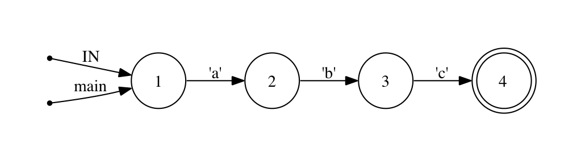

!SLIDE 
# Regular expressions are a syntax

!SLIDE 
# Regular expressions are a (horrible|great) syntax

!SLIDE bullets incremental
# Some Perfectly Normal Syntax
* ^$ \A\Z
* [A-Za-z0-9] [:alnum:]
* oh (hai|hi) (\w+)
* f(?=o{2})
* /facepalm

!SLIDE bullets incremental
# An Observation
.notes There may be a better word than observation 

* Writing a regular expression that doesn't do what you want
* is more common than writing one that causes a syntax error
* despite the fact that it failed because of its syntax.

!SLIDE
# A Digression Concerning
# The Availability of T-Shirts

!SLIDE small bullets incremental
# Semantic Failure, Syntactic Confusion
* Failures with regular expressions are usually _semantic_
* (This doesn't mean the syntax is that great)
* Two causes of confusion

.notes The primary source is that, well, Regexen are confusing
.notes It's really easy to write some that are impossible to understand
.notes Ragel addresses some of the syntax difficulties (but not all) 
.notes We'll get to that in a second, but the other cause is how we think about matching

!SLIDE bullets
# Syntax

* Character for character, few things produce complexity like a regular expression
* If only there were a way to visualize what it is they create...

!SLIDE
# Thinking About Matching

!SLIDE 
# Regular Expressions Are A Syntax For Specifying State Machines

!SLIDE bullets
# State Machines
* Characters in the regex are the _transitions_
* The characters of input are the _events_
* The _states_ are determined by the compiler

!SLIDE center bullets incremental
# Example: /abc/
* "a", "b" and "c" are named transitions
* 

.notes Ragel converts a series of machines into a table-driven* FSM that reads bytes one at a time until it reaches the end of input
