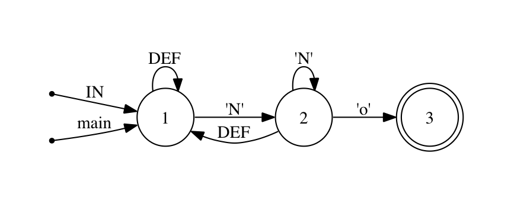

!SLIDE 
# Some Ragel

!SLIDE bullets
    @@@ Ruby
    class RagelTest
      %%{
        machine m;
        action print_me { puts data[p].chr; }
        Vowels = [aeiou] >print_me;
        main := (Vowels | any)+;
      }%%

      def initialize(str)
        %%write data;
        data = str.unpack("c*");
        %%write init;
        %%write exec;
      end
    end
*

!SLIDE bullets
    @@@ Ruby
    class RagelTest
      %%{
        machine m;
        action print_me { puts data[p].chr; }
        Vowels = [aeiou] >print_me;
        main := (Vowels | any)+;
      }%%

      def initialize(str)
        %%write data;
        data = str.unpack("c*");
        %%write init;
        %%write exec;
      end
    end
* machine m;

!SLIDE bullets
    @@@ Ruby
    class RagelTest
      %%{
        machine m;
        action print_me { puts data[p].chr; }
        Vowels = [aeiou] >print_me;
        main := (Vowels | any)+;
      }%%

      def initialize(str)
        %%write data;
        data = str.unpack("c*");
        %%write init;
        %%write exec;
      end
    end
* action print_me { puts data[p].chr; }

!SLIDE bullets
    @@@ Ruby
    class RagelTest
      %%{
        machine m;
        action print_me { puts data[p].chr; }
        Vowels = [aeiou] >print_me;
        main := (Vowels | any)+;
      }%%

      def initialize(str)
        %%write data;
        data = str.unpack("c*");
        %%write init;
        %%write exec;
      end
    end
* Vowels = [aeiou] >print_me;

!SLIDE bullets
    @@@ Ruby
    class RagelTest
      %%{
        machine m;
        action print_me { puts data[p].chr; }
        Vowels = [aeiou] >print_me;
        main := (Vowels | any)+;
      }%%

      def initialize(str)
        %%write data;
        data = str.unpack("c*");
        %%write init;
        %%write exec;
      end
    end
*  main := (Vowels | any)+;

!SLIDE bullets
    @@@ Ruby
    class RagelTest
      %%{
        machine m;
        action print_me { puts data[p].chr; }
        Vowels = [aeiou] >print_me;
        main := (Vowels | any)+;
      }%%

      def initialize(str)
        %%write data;
        data = str.unpack("c*");
        %%write init;
        %%write exec;
      end
    end
* %%write data;

!SLIDE bullets
    @@@ Ruby
    class RagelTest
      %%{
        machine m;
        action print_me { puts data[p].chr; }
        Vowels = [aeiou] >print_me;
        main := (Vowels | any)+;
      }%%

      def initialize(str)
        %%write data;
        data = str.unpack("c*");
        %%write init;
        %%write exec;
      end
    end
* data = str.unpack("c*");

!SLIDE bullets
    @@@ Ruby
    class RagelTest
      %%{
        machine m;
        action print_me { puts data[p].chr; }
        Vowels = [aeiou] >print_me;
        main := (Vowels | any)+;
      }%%

      def initialize(str)
        %%write data;
        data = str.unpack("c*");
        %%write init;
        %%write exec;
      end
    end
* %%write init

!SLIDE bullets
    @@@ Ruby
    class RagelTest
      %%{
        machine m;
        action print_me { puts data[p].chr; }
        Vowels = [aeiou] >print_me;
        main := (Vowels | any)+;
      }%%

      def initialize(str)
        %%write data;
        data = str.unpack("c*");
        %%write init;
        %%write exec;
      end
    end
* %%write exec

!SLIDE bullets
    @@@ Ruby
    class RagelTest
      %%{
        machine m;
        action print_me { puts data[p].chr; }
        Vowels = [aeiou] >print_me;
        main := (Vowels | any)+;
      }%%

      def initialize(str)
        %%write data;
        data = str.unpack("c*");
        %%write init;
        %%write exec;
      end
    end
* data and p

!SLIDE center

!SLIDE center

!SLIDE 

!SLIDE bullets incremental center
# Simple Machine Definitions

    @@@ Ruby
    'text'
    [tex]
    't'..'x'
    /text/
    any, white, lower, alnum, digit

!SLIDE
# Operators

!SLIDE bullets center
## Kleene star
    @@@ Ruby
    'words'*
## One or more
    @@@ Ruby
    'words'+
## Optional
    @@@ Ruby
    'words'?
## Negation
    @@@ Ruby
    !'words'
    ^'\n'
!SLIDE center
# Union
    @@@ Ruby
    'foo' | 'bar'
!SLIDE center
# Intersection
    @@@ Ruby
    any{10} & [aeiou]
!SLIDE center
# Difference
    @@@ Ruby
    any+ - 'foo'

!SLIDE center
# Concatenation
    @@@ Ruby
    [a-z]* . '\n'

!SLIDE center
# Concatenation
    @@@ Ruby
    [a-z]* '\n'

!SLIDE
    @@@Ruby
    EOL = ('\n' | '\r\n');

    Tag = ('@' [^@\r\n\t ]+);
  
    I18N_Step = ("* " | "Given " | 
       "When " | "Then " | "And " | "But ");

!SLIDE center
###  tokens = BOM? (space | EOL)* (Tags | Comment | FeatureHeading | BackgroundHeading | ScenarioHeading | ScenarioOutlineHeading | ExamplesH    eading | Step | Row | PyString)* (space | EOL)* EOF;

!SLIDE 
# So what?

!SLIDE bullets center
# Actions
    @@@ Ruby
    Vowels = [aeiou] >print_me;

!SLIDE bullets center
# Inline actions

    @@@ Ruby
    '\n'+ @{ puts "I have a newline" }

!SLIDE bullets
# Named actions
    @@@ Ruby
    action CountNewlines {
      @newlines += 1
    }

    EOL = '\n'+ @CountNewlines
.notes Why you probably want to do this.  
.notes so you can extract them easily to another machine, and have
.notes different language implementations
!SLIDE bullets

* Entering: < 
* All Transitions: $
* Finishing: @
* Leaving: %

!SLIDE center bullets
# Entering Action
    @@@ Ruby
    main := 'Pony' >do_something
*  

!SLIDE center bullets
# All Transitions Action
    @@@ Ruby
    main := 'Pony' $do_something

*  

!SLIDE center bullets
# Finishing Action
    @@@ Ruby
    main := ('pon' 'y'+) @print_details

*  

!SLIDE center bullets
# Leaving Action
    @@@ Ruby
    main := 'Pony' %do_something

* 

!SLIDE 
# Guards and Nondeterminism

!SLIDE center
    @@@ Ruby
    any* 'No';
!SLIDE center bullets
    @@@ Ruby
    any* 'No';
*  

### Without a guard

!SLIDE center bullets
    @@@ Ruby
    any* :>> 'No';
*  

### Finish-guarded

!SLIDE center bullets

    @@@ Ruby
    any* :> 'No';
*  

### Entry-guarded

!SLIDE bullets
* left-guarded       <:
* longest-match      **
* named-priorities

!SLIDE bullets
    @@@ Ruby

    action begin_content {
      @content_start = p
      @current_line = @line_number
    }

    action store_tag_content {
      con = utf8_pack(data[@content_start...p])
      @listener.tag(con, @curent_line)
    }

    Tag = (('@' [^@\r\n\t ]+) >begin_content) \
      %store_tag_content;

!SLIDE center

