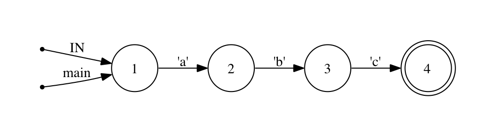

!SLIDE
# The Problems With Regular Expressions
## There are two

!SLIDE 
# 1. Syntax
# 2. Syntax

!SLIDE 
# Regular expressions are a syntax

!SLIDE 
# Regular expressions are a (horrible|great) syntax

!SLIDE bullets incremental
# Some Perfectly Normal Syntax
* ^$ \A\Z
* [A-Za-z0-9] [:alnum:]
* oh (hai|hi) (\w+)
* f(?=o{2})
* /facepalm

!SLIDE bullets incremental
# An Observation

* Writing a regular expression that doesn't do what you want
* is more common than writing one that causes a syntax error
* despite the fact that it failed because of its syntax.

!SLIDE small bullets incremental
# Semantic Failure, Syntactic Confusion
* Failures with regular expressions are usually _semantic_
* (This doesn't mean syntax is not the problem)

!SLIDE bullets
# Syntax

* Character for character, few things produce complexity like a regular expression
* If only there were a way to visualize what it is they create...

!SLIDE
# Thinking About Matching
## What does it mean "to match"?
## What is doing the matching?

!SLIDE bullets incremental
# Statements You May Have Heard
* "I matched the string against the regex"
* "This regex is matching more than it should"
* "All I did was try to parse HTML with regexen, and now Cthulhu insists I bring him home to meet Mom." 

!SLIDE
# REGULAR EXPRESSIONS DO NOT DO THE MATCHING
## There is no "there" there

!SLIDE
# "Oh my god you guys! My class definition retrieved a record from the database!"

!SLIDE 
# Regular Expressions Are A Syntax For Specifying State Machines

!SLIDE bullets
# State Machines
* Characters in the regex are the _transitions_
* The characters of input are the _events_
* The _states_ are determined by the compiler

!SLIDE
# Ragel clarifies what you are doing when you are working with regular expressions 

!SLIDE center bullets incremental
# Example: /abc/
* "a", "b" and "c" are named transitions
* 
